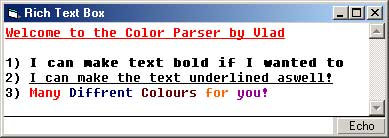



## Rich Textbox IRC Color Parser

### Description

The purpose of this code is to easily allow you to add color to a richtextbox if you are making an IRC client.

I am currently in the process of writing an IRC client and I have had people telling me it's hard.. so I made my own color parser, it does not support backgrounds.

Anyway, it works and I am going to make use of it, you could too, it supports 7 colors defined just like irc through character 3-31-2-15.
 
### More Info
 

             |
---                |---
**Submitted On**   |2001-01-11 13:42:00
**By**             |[Vlad Stanculescu](https://github.com/Planet-Source-Code/PSCIndex/blob/master/ByAuthor/vlad-stanculescu.md)
**Level**          |Beginner
**User Rating**    |4.8 (38 globes from 8 users)
**Compatibility**  |VB 4\.0 \(16\-bit\), VB 4\.0 \(32\-bit\), VB 5\.0, VB 6\.0
**Category**       |[Graphics](https://github.com/Planet-Source-Code/PSCIndex/blob/master/ByCategory/graphics__1-46.md)
**World**          |[Visual Basic](https://github.com/Planet-Source-Code/PSCIndex/blob/master/ByWorld/visual-basic.md)
**Archive File**   |[CODE\_UPLOAD136521102001\.zip](https://github.com/Planet-Source-Code/vlad-stanculescu-rich-textbox-irc-color-parser__1-14331/archive/master.zip)

